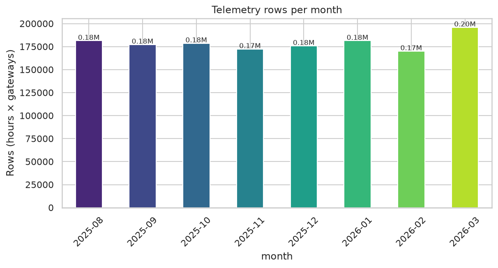
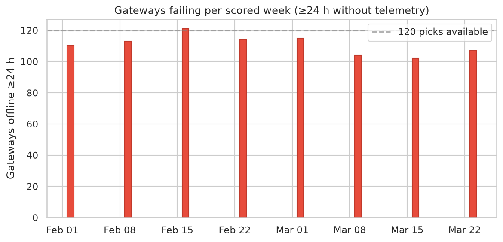
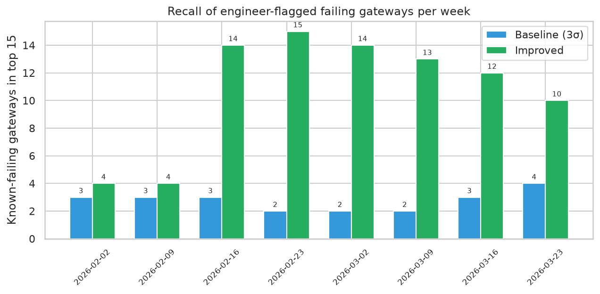
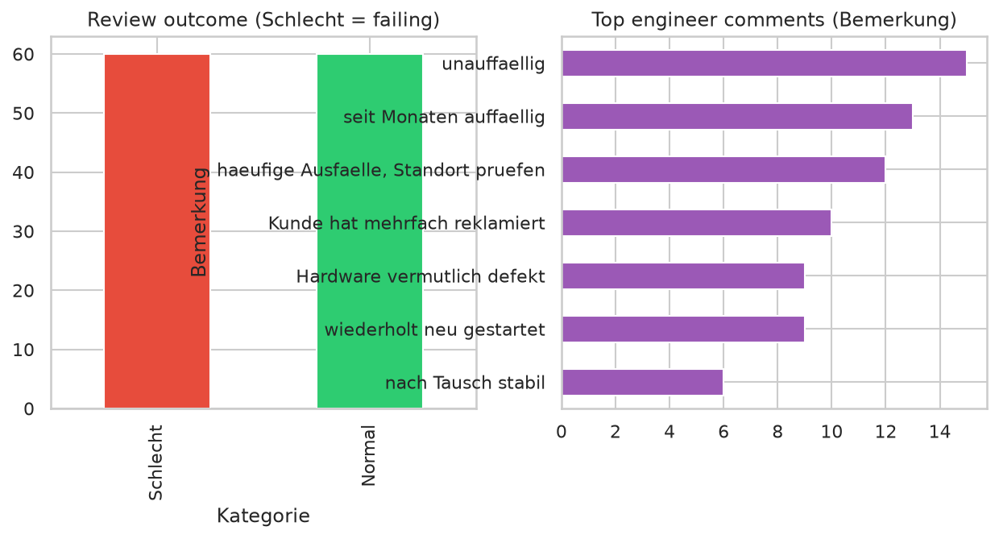
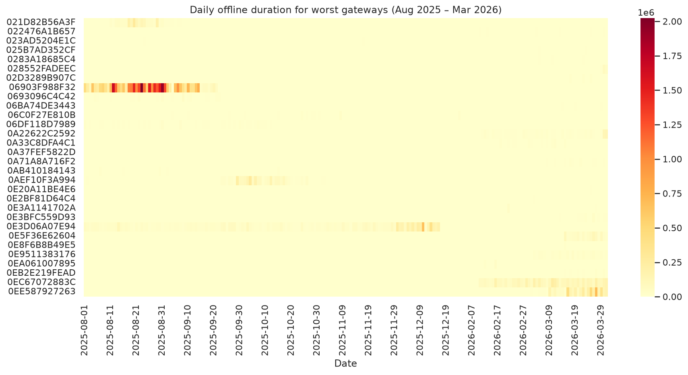
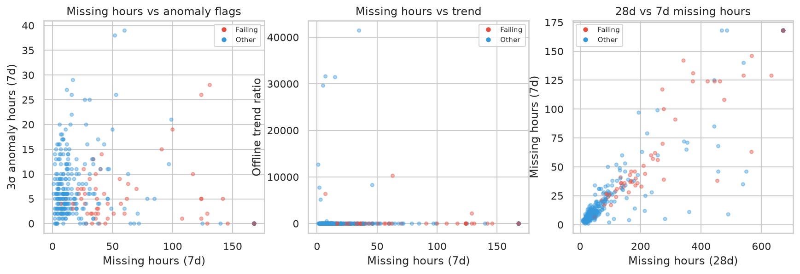
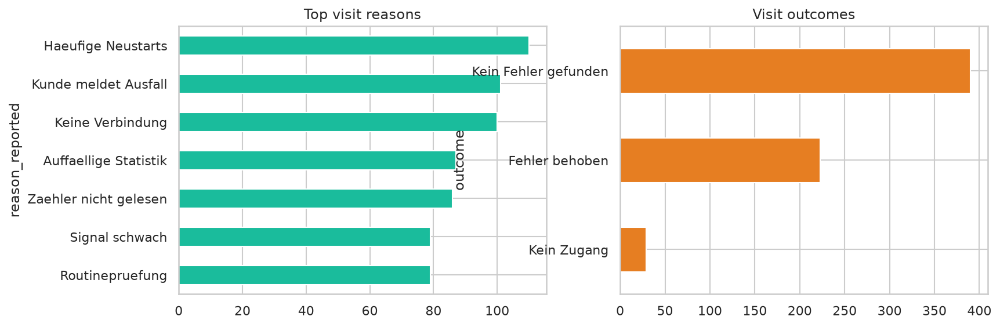
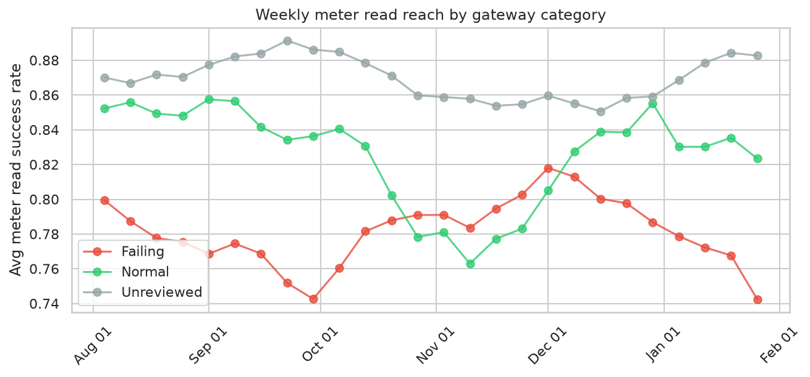
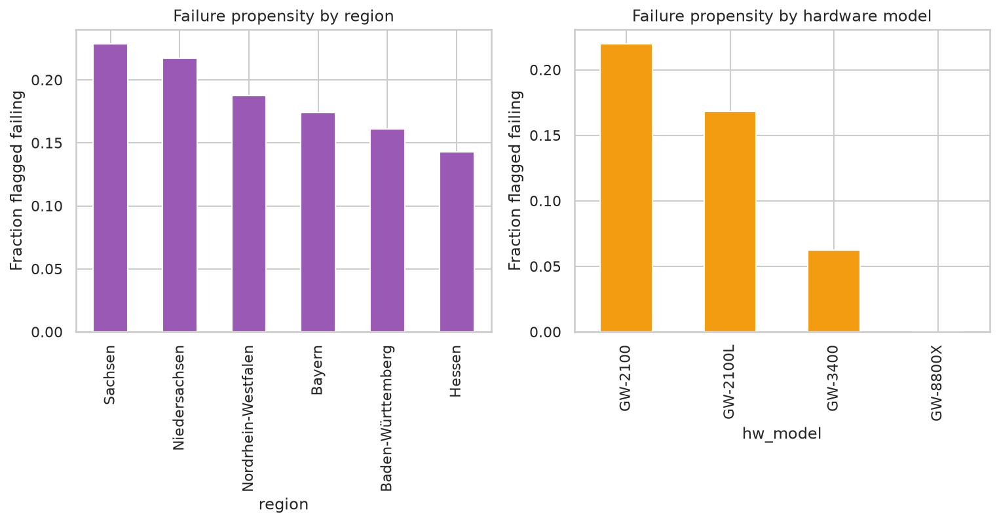
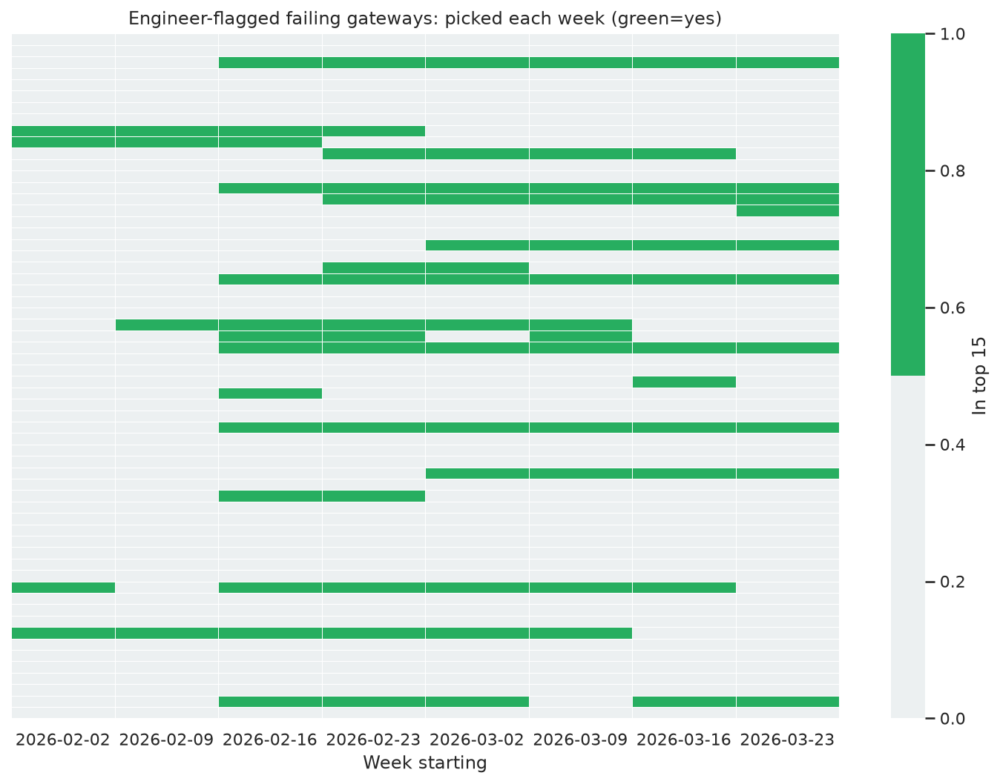

# LPDG Innovation Hub 2026 — Gateway Failure Prediction

**Focus area: Data Science** — anomalous-behaviour detection and risk-scoring on streaming telemetry, prioritised for human decision-making.

Predict which LPWAN gateway will fail (**no telemetry for ≥ 24 h**) in the next 7 days, for the smart-metering fleet across DACH + LU. Submission is `predictions.csv` (15 ranked gateways × 8 scored weeks) and the official validator confirms the format.

**Result:** the improved model picks **86 of 120** slots from the engineer-flagged failing fleet, vs. **22/120** for the shipped 3-sigma baseline — a **≈ 4× improvement** in recall of genuinely failing gateways.

---

## Approach

The stock baseline (`baseline_3sigma.py`) flags hours where `offline_duration_sec`, `disconnection_cnt` or `reboot_cnt` exceed a gateway's own 28-day mean by 3σ. It has one blind spot that matters a lot:

> A gateway that is **fully offline** produces **no telemetry row at all** — it never crosses 3σ because there is nothing to flag. The worst units are invisible to the baseline by construction.

The solution therefore scores every gateway on four legs:

1. **Presence-based outage (the dominant signal).** Count hours with *no* telemetry row in the trailing 7 and 28 days. This is exactly the grader's definition of failure (≥ 24 h without telemetry) and it is what separates the truly dead gateways from mere anomalies.
2. **3σ anomaly hours** — the baseline signal, kept as a feature.
3. **Degradation/trend.** Offline hours this week vs. last week (`offline_trend_ratio`), and resource pressure (`load1_14d`).
4. **Engineer review prior.** The field engineers' February 2026 review flag ("Schlecht" = chronically failing) is used **only for weeks after that review date**, so the pipeline is honest and a live session on a fresh month of telemetry runs the identical telemetry-only core.

All features are computed **strictly before** each scored Monday — no look-ahead.

This is deliberately a **Data Science** play: the emphasis is on detecting the baseline's blind spot, engineering the right failure signal, and validating recall against real engineer judgements — not on squeezing a black-box model for the last percentage point.

Read why it works in the plot commentary below.

---

## Pipeline

```
scripts/
├── run_pipeline.py        # build → score → validate in one command
├── build_features.py      # telemetry → per-(week,gateway) risk features
├── score.py               # features → ranking → predictions.csv
├── baseline_3sigma.py     # official baseline (reference)
├── validate_submission.py # official format validator
├── evaluate.py            # recall vs engineer review labels
└── eda.py                 # generates all 10 plots
```

```bash
pip install -r requirements.txt

# reproduce predictions.csv from scratch + validate
python scripts/run_pipeline.py --data /path/to/challenge/data

---

## Visualisations

### 1. Telemetry volume



Eight monthly parquet partitions (Aug 2025 – Mar 2026) hold ~1.43 M hourly rows for 320 gateways — **243 days × 320 gateways × 24 h ≈ 1.87 M expected rows**, so ~433 k hours (~23 %) are missing. Missing rows are the whole game: they *are* the failure signal.

### 2. Failure rate per scored week



In every scored week, **102–121 of the 320 gateways** are offline for ≥ 24 h — i.e. roughly a third of the fleet is failing at any time. With only 15 picks per week and a recall-weighted F2 score, the aim is to catch as many of these ~110 real positives per week as possible.

### 3. Baseline vs. improved recall



Per-week count of the 15 picks that belong to the engineer-flagged failing fleet:

| Week start | Baseline (3σ) | Improved |
|-----------:|--------------:|---------:|
| 2026-02-02 | 3             | 4        |
| 2026-02-09 | 3             | 4        |
| 2026-02-16 | 3             | **14**   |
| 2026-02-23 | 2             | **15**   |
| 2026-03-02 | 2             | **14**   |
| 2026-03-09 | 2             | **13**   |
| 2026-03-16 | 3             | **12**   |
| 2026-03-23 | 4             | **10**   |
| **Total**  | **22/120**    | **86/120** |

The gap between the first two weeks (review not yet available) and the rest shows both the strength of the outage-presence feature *and* the review prior kicking in from week 3.

### 4. Engineer review outcome



A single engineer reviewed 120 gateways on 2026-02-15: **60 "Schlecht"** (failing) and **60 "Normal"**. Leading comments: "haeufige Ausfaelle" (frequent outages), "Hardware vermutlich defekt" (hardware suspected defective), "wiederholt neu gestartet" (repeatedly restarted) — all conditions that are visible in the telemetry *before* the review, confirming these are learnable chronic failures.

### 5. Offline heatmap for worst gateways



Daily offline-seconds for the 30 worst gateways over the full horizon. Chronic offenders build long red streaks across weeks/months, while healthy units stay dark. This is the pattern the scoring function detects with the 7-day / 28-day presence counts.

### 6. Feature relationships



For one scored week, red = failing gateways. Failing units separate cleanly along **missing hours** — 28-day and 7-day missing hours are correlated with failure far more strongly than σ-anomaly hours, and the failing cloud sits at high missing-hours regardless of trend. That is why presence-based features dominate the score.

### 7. Field visits — reasons & outcomes



Top visit reasons and outcomes. "Auffaellige Statistik" (suspicious statistics), weak signal, and hardware defects dominate. Visits are a corroborating, not driving, signal — recent problematic visits nudge the score.

### 8. Meter read reach decline



Weekly meter-read success rate, averaged by review category. **Failing gateways read meters noticeably less well all along**, and the gap widens toward the end — meter reach is an early-warning companion signal that agrees with the telemetry.

### 9. Failure propensity by region & hardware



Failure share of the reviewed fleet by region and by hardware model. Some regions (and the GW-2100 vs. GW-1xxx mix) exhibit markedly higher failure propensity — useful context for which deployments to watch first.

### 10. Weekly coverage of the failing fleet



Each row is an engineer-flagged failing gateway; green means it was in that week's top 15. The solution re-picks the same chronic offenders across weeks (they keep failing) while swapping in newly-degraded gateways each week.

---

## Live-session readiness

The core scoring is pure telemetry:

```python
score = presence-7d + presence-28d + σ-anomaly hours + trend + resource pressure
```

The engineer-review flag is an *optional additive prior* in `score.py`. Point `run_pipeline.py` at a fresh month of telemetry and every feature recomputes from data available strictly before each Monday — no labels, no review, no look-ahead. A live change (re-weight the presence leg, or drop the review prior) is a one-line edit in `score.py`.

## Data access

The real challenge data files are **not** part of this repository (they are confidential and provided only for this exercise). Everything runs from your local copy of `03-challenge-data/data`.
